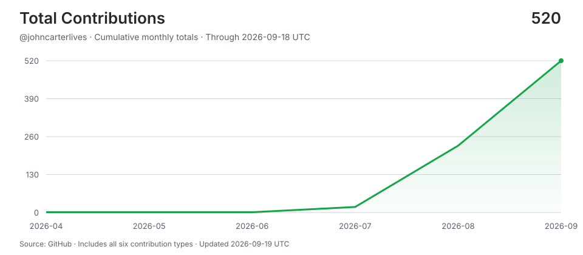

# johncarterlives

> Shipping with AI agents around the clock -- human hours for thinking, machine hours for doing.
>
> Stats auto-updated by [aidevops](https://aidevops.sh).

<!-- STATS-START -->
## Work with AI

| Metric | Yesterday | Prior 7 Days | Prior 28 Days | Prior 365 Days |
| --- | ---: | ---: | ---: | ---: |
| Screen time (Mac) | 4.6h | 105.7h | 128.1h | ~2922h* |
| Interactive human attention | 2.5h | 34.1h | 60.4h | 130.2h |
| Interactive AI generation | 5.5h | 84.4h | 122.5h | 206.7h |
| Worker-classified human attention | 0.0h | 0.1h | 0.9h | 2.0h |
| Worker/headless AI generation | 0.6h | 30.9h | 44.9h | 53.4h |
| Additive observed work | 8.6h | 149.4h | 228.0h | 391.3h |
| Interactive sessions | 13 | 76 | 126 | 265 |
| Worker sessions | 59 | 442 | 630 | 714 |

_Screen time from screen-time-history:daily-observations; collection status: ok. *365-day estimate uses observed calendar coverage._

_Periods are completed local calendar days ending at midnight; today is excluded._

_Human attention is unioned wall-clock time, so overlapping sessions are not double-counted. AI generation is additive machine work across sessions; it is not wall-clock concurrency._

_AI session 365-day totals cover 150 days of local assistant session history (not extrapolated)._

## AI Model Usage (last 30 days)

| Model | Requests | Input | Output | Cache read | Cache Hit-Rate % | Session Count | Session Hours |
| --- | ---: | ---: | ---: | ---: | ---: | ---: | ---: |
| gpt-5.6-sol | 15,500 | 76.9M | 3.8M | 2,099.4M | 96.5% | 105 | 120.8h |
| gpt-5.6-terra | 6,344 | 51.3M | 1.0M | 495.8M | 90.6% | 571 | 21.6h |
| gpt-5.6-luna | 940 | 13.4M | 355K | 92.0M | 87.2% | 84 | 28.5h |
| muse-spark-1.3-contributor-free | 44 | 323K | 10K | 5.3M | 94.3% | 2 | 0.1h |
| big-pickle | 42 | 193K | 15K | 3.0M | 94.1% | 1 | 0.1h |
| Qwen3.8-27B-oQ6e-mtp:qwen38-q6-stable | 7 | 63K | 1K | 249K | 79.7% | 1 | 0.3h |
| mtplx-qwen38-27b-optimized-quality | 1 | 0 | 0 | 0 | 0.0% | 1 | 0.0h |
| **Total** | **22,878** | **142.2M** | **5.3M** | **2,696.0M** | **95%** | **745** | **171.5h** |

_2,843.6M total tokens processed. 95% cache hit rate._

## AI Model Usage (all time)

| Model | Requests | Input | Output | Cache read | Cache Hit-Rate % | Session Count | Session Hours |
| --- | ---: | ---: | ---: | ---: | ---: | ---: | ---: |
| gpt-5.6-sol | 20,775 | 108.4M | 5.1M | 2,759.3M | 96.2% | 172 | 171.2h |
| gpt-5.5 | 7,076 | 45.3M | 2.0M | 717.6M | 94.1% | 127 | 33.4h |
| gpt-5.6-terra | 6,346 | 51.3M | 1.0M | 495.8M | 90.6% | 573 | 21.6h |
| gpt-5.6-luna | 1,194 | 16.6M | 418K | 120.6M | 87.9% | 93 | 29.5h |
| gemma4:26b-mlx | 82 | 4.1M | 26K | 0 | 0.0% | 5 | 1.1h |
| big-pickle | 44 | 257K | 15K | 3.0M | 92.3% | 3 | 0.2h |
| muse-spark-1.3-contributor-free | 44 | 323K | 10K | 5.3M | 94.3% | 2 | 0.1h |
| gemma4-agent | 17 | 314K | 4K | 0 | 0.0% | 2 | 0.1h |
| Qwen3.8-27B-oQ6e-mtp:qwen38-q6-stable | 7 | 63K | 1K | 249K | 79.7% | 1 | 0.3h |
| gemma4-agent-mlx:latest | 6 | 170K | 3K | 0 | 0.0% | 2 | 0.1h |
| mtplx-qwen38-27b-optimized-quality | 1 | 0 | 0 | 0 | 0.0% | 1 | 0.0h |
| **Total** | **35,592** | **227.1M** | **8.7M** | **4,102.2M** | **94.8%** | **959** | **257.7h** |

_4,338.1M total tokens processed. 94.8% cache hit rate._
<!-- STATS-END -->

<!-- CONTRIBUTIONS-START -->
## Contributions

- **[aidevops](https://github.com/marcusquinn/aidevops)** -- Vibe-Coding is easy. DevOps is hard. OpenCode & Git token-efficient AI agent automation for your app, business, and personal development. Opinionated tools, services, CLI & API stack for speed, security, and 24/7 results. Open-source first. SOTA everything. Try on your repos for money-making magic.
- **[playwriter](https://github.com/remorses/playwriter)** -- Chrome extension & CLI to let agents control your browser. Runs Playwright snippets in a stateful sandbox. Available as CLI or MCP
<!-- CONTRIBUTIONS-END -->

## Connect

---

<!-- UPDATED-START -->
_Stats auto-updated 2026-09-05 07:13 UTC by [aidevops](https://aidevops.sh) pulse._
<!-- UPDATED-END -->

<!-- TOTAL-CONTRIBUTIONS-START -->

  <a href="https://commit-history.com/johncarterlives?metric=total" target="_blank" rel="noopener noreferrer">
    <picture>
      <source media="(prefers-color-scheme: dark)" srcset="assets/contributions/total-dark.svg" />
      
    </picture>
  </a>

[Verify on commit-history.com](https://commit-history.com/johncarterlives?metric=total) · [Chart data](assets/contributions/total.json)

Includes commits, issues, pull requests, reviews, repositories, and restricted contributions. Refreshed daily through the prior UTC day; commit-history.com may use a different refresh cutoff. GitHub controls link navigation—Ctrl/Cmd-click opens verification in a new tab.
<!-- TOTAL-CONTRIBUTIONS-END -->
