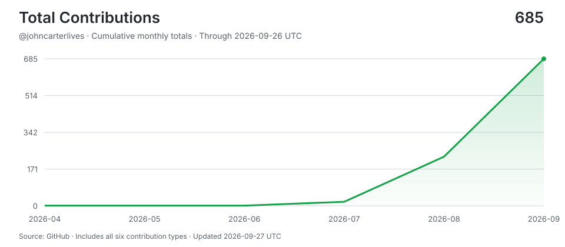

# johncarterlives

> Shipping with AI agents around the clock -- human hours for thinking, machine hours for doing.
>
> Stats auto-updated by [aidevops](https://aidevops.sh).

<!-- STATS-START -->
## Work with AI

| Metric | Yesterday | Prior 7 Days | Prior 28 Days | Prior 365 Days |
| --- | ---: | ---: | ---: | ---: |
| Screen time (Mac) | 6.8h | 33.3h | 122.2h | ~2116h* |
| Interactive human attention | 15.0h | 34.9h | 121.8h | 277.6h |
| Interactive AI generation | 21.2h | 81.0h | 310.1h | 572.3h |
| Worker-classified human attention | 0.0h | 4.6h | 106.9h | 118.7h |
| Worker/headless AI generation | 3.9h | 26.3h | 89.2h | 186.1h |
| Additive observed work | 40.2h | 144.3h | 597.6h | 1,117.2h |
| Interactive sessions | 29 | 76 | 274 | 581 |
| Worker sessions | 280 | 1,161 | 3,224 | 4,143 |

_Screen time from screen-time-history:daily-observations; collection status: ok. *365-day estimate uses observed calendar coverage._

_Periods are completed local calendar days ending at midnight; today is excluded._

_Human attention is unioned wall-clock time, so overlapping sessions are not double-counted. AI generation is additive machine work across sessions; it is not wall-clock concurrency._

_AI session 365-day totals cover 183 days of local assistant session history (not extrapolated)._

## AI Model Usage (last 30 days)

| Model | Requests | Input | Output | Cache read | Cache write | Cache Hit-Rate % | Session Count | Session Hours |
| --- | ---: | ---: | ---: | ---: | ---: | ---: | ---: | ---: |
| gpt-5.6-sol | 30,643 | 125.5M | 6.7M | 4,285.0M | 0 | 97.2% | 338 | 227.7h |
| gpt-6.1-sol | 11,995 | 62.4M | 2.8M | 1,369.5M | 0 | 95.6% | 472 | 86.5h |
| gpt-5.6-terra | 9,866 | 222.2M | 1.8M | 729.2M | 0 | 76.6% | 977 | 34.0h |
| gpt-6-astra | 4,674 | 31.5M | 1.5M | 880.2M | 0 | 96.5% | 154 | 60.8h |
| gpt-6-luna | 3,711 | 94.8M | 723K | 238.7M | 0 | 71.6% | 1,129 | 14.6h |
| gpt-6-sol | 2,916 | 25.9M | 430K | 232.8M | 0 | 90.0% | 279 | 14.4h |
| gpt-5.6-luna | 915 | 28.2M | 101K | 59.5M | 0 | 67.8% | 365 | 2.2h |
| qwen3.8-flash | 22 | 87K | 2K | 1.3M | 0 | 93.9% | 1 | 0.1h |
| muse-spark-1.3-contributor-free | 19 | 583K | 13K | 2.3M | 0 | 79.9% | 1 | 0.1h |
| qwen/qwen3.8-flash | 1 | 0 | 0 | 0 | 0 | 0.0% | 1 | 0.0h |
| **Total** | **64,762** | **591.6M** | **14.2M** | **7,798.9M** | **0** | **92.9%** | **3,609** | **440.2h** |

_8,404.7M total tokens processed. 92.9% cache hit rate._

## AI Model Usage (all time)

| Model | Requests | Input | Output | Cache read | Cache write | Cache Hit-Rate % | Session Count | Session Hours |
| --- | ---: | ---: | ---: | ---: | ---: | ---: | ---: | ---: |
| gpt-5.6-sol | 54,086 | 245.8M | 12.5M | 7,425.8M | 0 | 96.8% | 519 | 440.4h |
| gpt-5.6-terra | 16,784 | 282.9M | 3.0M | 1,267.4M | 0 | 81.8% | 1,606 | 57.5h |
| gpt-6.1-sol | 11,995 | 62.4M | 2.8M | 1,369.5M | 0 | 95.6% | 472 | 86.5h |
| gpt-5.5 | 7,076 | 45.3M | 2.0M | 717.6M | 0 | 94.1% | 127 | 33.4h |
| gpt-6-astra | 7,045 | 39.6M | 2.1M | 1,280.0M | 0 | 97.0% | 168 | 79.2h |
| gpt-6-luna | 3,711 | 94.8M | 723K | 238.7M | 0 | 71.6% | 1,129 | 14.6h |
| gpt-6-sol | 2,916 | 25.9M | 430K | 232.8M | 0 | 90.0% | 279 | 14.4h |
| gpt-5.6-luna | 2,137 | 45.5M | 522K | 181.2M | 0 | 79.9% | 466 | 31.7h |
| gemma4:26b-mlx | 82 | 4.1M | 26K | 0 | 0 | 0.0% | 5 | 1.1h |
| muse-spark-1.3-contributor-free | 63 | 906K | 23K | 7.6M | 0 | 89.4% | 3 | 0.2h |
| big-pickle | 44 | 257K | 15K | 3.0M | 0 | 92.3% | 3 | 0.2h |
| qwen3.8-flash | 22 | 87K | 2K | 1.3M | 0 | 93.9% | 1 | 0.1h |
| gemma4-agent | 17 | 314K | 4K | 0 | 0 | 0.0% | 2 | 0.1h |
| Qwen3.8-27B-oQ6e-mtp:qwen38-q6-stable | 7 | 63K | 1K | 249K | 0 | 79.7% | 1 | 0.3h |
| gemma4-agent-mlx:latest | 6 | 170K | 3K | 0 | 0 | 0.0% | 2 | 0.1h |
| mtplx-qwen38-27b-optimized-quality | 1 | 0 | 0 | 0 | 0 | 0.0% | 1 | 0.0h |
| nemotron-3.5-lightning-30b-a3b | 1 | 49K | 107 | 0 | 0 | 0.0% | 1 | 0.0h |
| qwen/qwen3.8-flash | 1 | 0 | 0 | 0 | 0 | 0.0% | 1 | 0.0h |
| **Total** | **105,994** | **848.6M** | **24.3M** | **12,725.7M** | **0** | **93.7%** | **4,649** | **759.9h** |

_13,598.6M total tokens processed. 93.7% cache hit rate._
<!-- STATS-END -->

<!-- CONTRIBUTIONS-START -->
## Contributions

- **[aidevops](https://github.com/marcusquinn/aidevops)** -- Vibe-Coding is easy. DevOps is hard. OpenCode & Git token-efficient AI agent automation for your app, business, and personal development. Opinionated tools, services, CLI & API stack for speed, security, and 24/7 results. Open-source first. SOTA everything. Try on your repos for money-making magic.
- **[playwriter](https://github.com/remorses/playwriter)** -- Chrome extension & CLI to let agents control your browser. Runs Playwright snippets in a stateful sandbox. Available as CLI or MCP
<!-- CONTRIBUTIONS-END -->

## Connect

---

<!-- UPDATED-START -->
_Stats auto-updated 2026-10-08 13:23 UTC by [aidevops](https://aidevops.sh) pulse._
<!-- UPDATED-END -->

<!-- TOTAL-CONTRIBUTIONS-START -->

  <a href="https://commit-history.com/johncarterlives?metric=total" target="_blank" rel="noopener noreferrer">
    <picture>
      <source media="(prefers-color-scheme: dark)" srcset="assets/contributions/total-dark.svg" />
      
    </picture>
  </a>

[Verify on commit-history.com](https://commit-history.com/johncarterlives?metric=total) · [Chart data](assets/contributions/total.json)

Includes commits, issues, pull requests, reviews, repositories, and restricted contributions. Refreshed daily through the prior UTC day; commit-history.com may use a different refresh cutoff. GitHub controls link navigation—Ctrl/Cmd-click opens verification in a new tab.
<!-- TOTAL-CONTRIBUTIONS-END -->
